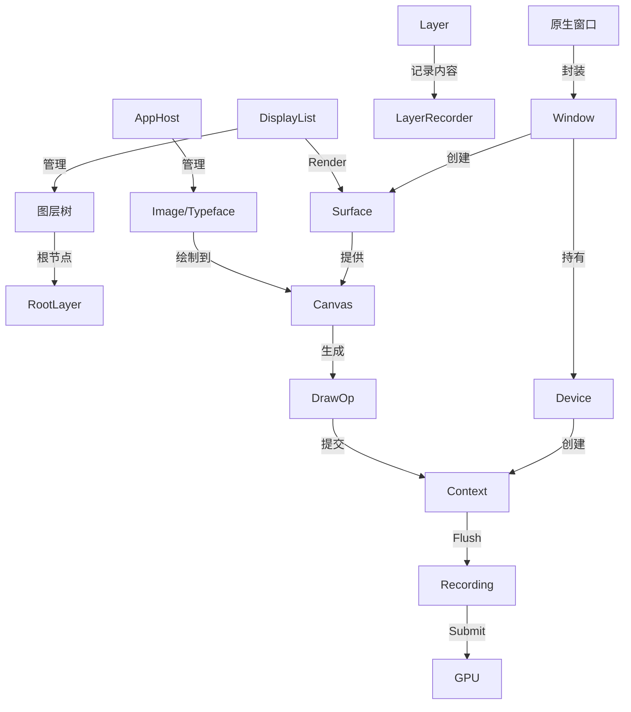

# TGFX 核心概念指南

本文档详细介绍了 TGFX 项目中的核心类及其作用，帮助开发者理解其架构设计和各组件之间的关系。

## 核心类概览

| 类名 | 作用 | 关键职责 |
| :--- | :--- | :--- |
| **DisplayList** | 显示列表 | 管理图层树（Layer Tree）的顶层容器，负责渲染调度、脏区重绘和分块缓存策略。 |
| **Layer** | 图层 | 视觉元素的基本单元，支持层级嵌套、变换、混合模式、滤镜及 3D 空间属性。 |
| **Typeface** | 字体面 | 管理字体样式、字形（Glyph）数据，支持从文件、数据流加载。 |
| **AppHost** | 应用宿主 | (hello2d 示例层) 资源管理器，提供图片和字体资源的统一访问接口。 |
| **Window** | 窗口抽象 | 连接原生窗口系统与 TGFX 渲染管线，管理渲染设备（Device）和画布表面（Surface）。 |
| **Image** | 图像 | 表示不可变的二维像素数据，支持多种来源（文件、编码数据、原生位图、硬件缓冲区、GPU纹理）。 |
| **Device** | 渲染设备 | GPU 上下文的持有者，负责创建和管理硬件资源。 |
| **Context** | 渲染上下文 | 封装具体的图形 API（如 OpenGL, Vulkan）操作，执行实际的绘制指令。 |
| **Surface** | 绘图表面 | 绘图的目标缓冲区，提供 Canvas 用于绘制操作。 |
| **Recording** | 录制命令 | 表示已从 Context 刷新但尚未提交到 GPU 的渲染命令快照，用于延迟提交。 |

---

## 详细解析

### 1. DisplayList (显示列表)

`DisplayList` 是图层树的根容器，它不直接包含可视内容，而是管理着一个 `RootLayer` 以及整个渲染流程的策略。

*   **定义位置**: `include/tgfx/layers/DisplayList.h`
*   **主要功能**:
    *   **渲染模式管理**: 支持三种渲染模式：
        *   `Direct`: 直接绘制，无缓存。
        *   `Partial`: 脏区重绘（默认），仅重绘变化区域，需要上一帧的缓存。
        *   `Tiled`: 分块渲染，将画面切分为多个 Tile 分别缓存，适合大图缩放和滚动。
    *   **交互属性**: 管理全局的 `zoomScale`（缩放）和 `contentOffset`（偏移），高效实现视图漫游。
    *   **缓存优化**: 提供子树缓存（Subtree Cache）功能，将静态的图层子树缓存为纹理以提升性能。
*   **代码示例**:
    ```cpp
    auto displayList = std::make_shared<tgfx::DisplayList>();
    displayList->root()->addChild(myLayer);
    displayList->render(surface);
    ```

### 2. Layer (图层)

`Layer` 是所有可视对象的基类。它定义了对象在场景中的位置、外观和层级关系。

*   **定义位置**: `include/tgfx/layers/Layer.h`
*   **主要功能**:
    *   **属性控制**: 位置（Position）、透明度（Alpha）、混合模式（BlendMode）、变换矩阵（Matrix/Matrix3D）。
    *   **层级管理**: `addChild`, `removeChild`, `parent` 等方法构建树状结构。
    *   **特效支持**: 支持滤镜（Filters）、图层样式（LayerStyles）和遮罩（Mask）。
    *   **3D 支持**: 通过 `setPreserve3D(true)` 开启 3D 渲染上下文，支持深度遮挡。
    *   **内容绘制**: 子类通过覆盖 `onUpdateContent(LayerRecorder* recorder)` 来描述具体的绘制内容（如矩形、路径、文本）。

### 3. Recording (录制命令)

`Recording` 是 GPU 命令流的一个快照。

*   **定义位置**: `include/tgfx/gpu/Recording.h`
*   **主要功能**:
    *   **延迟提交**: 允许 `Context` 将绘制命令生成与 GPU 提交解耦。
    *   **线程调度**: 可以在一个线程生成 `Recording`，在另一个持有 GPU 锁的线程提交执行。
    *   **顺序保证**: 提交新的 Recording 会自动强制提交之前未完成的 Recording，确保渲染顺序正确。

### 4. Typeface (字体面)

`Typeface` 是字体渲染的核心抽象，它代表了一种特定的字体样式（如 Arial Bold）。

*   **定义位置**: `include/tgfx/core/Typeface.h`
*   **主要功能**:
    *   **加载字体**: 支持通过字体族名（`MakeFromName`）、文件路径（`MakeFromPath`）、内存数据（`MakeFromBytes`/`MakeFromData`）创建实例。
    *   **字形管理**: 内部维护字符到字形 ID（GlyphID）的映射。

### 5. AppHost (应用宿主)

`AppHost` 是 `hello2d` 示例工程中的一个辅助类，主要用于跨层传递和管理资源。

*   **定义位置**: `hello2d/include/hello2d/AppHost.h`
*   **主要功能**:
    *   **资源注册**: 提供 `addImage` 和 `addTypeface` 方法注册全局资源。
    *   **资源获取**: 通过字符串名称（Name）获取对应的 `Image` 或 `Typeface` 对象。

### 6. Window (窗口)

`Window` 是 TGFX 对原生操作系统窗口的抽象封装。它是连接平台特定窗口系统与 TGFX 渲染管线的桥梁。

*   **定义位置**: `include/tgfx/gpu/Window.h`
*   **主要功能**:
    *   **设备管理**: 持有并管理 `Device` 对象。
    *   **Surface 管理**: 根据原生窗口状态创建和销毁 `Surface`。
    *   **上屏 (Present)**: 提供 `present()` 方法将渲染结果提交到屏幕显示。

### 7. Image (图像)

`Image` 是一个不可变（Immutable）的像素数据容器。

*   **定义位置**: `include/tgfx/core/Image.h`
*   **主要功能**:
    *   **多源创建**: 支持从文件、内存数据、原生位图、硬件缓冲区创建。
    *   **纹理代理**: 它可以不仅仅是内存中的像素，也可以是对 GPU 纹理的引用。

### 8. 其他重要角色

#### Device (设备)
*   **定义**: `include/tgfx/gpu/Device.h`
*   **作用**: 代表 GPU 硬件接口。负责创建 `Context`，管理纹理资源缓存（ResourceCache）。

#### Context (上下文)
*   **定义**: `include/tgfx/gpu/Context.h`
*   **作用**: 封装了具体的绘图指令流。它是单线程的，负责将 TGFX 的 `DrawOp` 转换为底层的 GL/Vulkan 指令。

#### Surface (表面)
*   **定义**: `include/tgfx/core/Surface.h`
*   **作用**: 绘图的画布。它持有一个 `Canvas`，所有绘图操作都通过 `Surface` 获取的 `Canvas` 进行。

## 协作关系图

### 图解说明 (Mermaid)

该图表使用 Mermaid 语法绘制。如果你在查看时无法看到图表，请确保你的 Markdown 阅读器（如 GitHub, VS Code 插件）支持 Mermaid。或者，你可以查看下方的**文本版关系图**。



### 文本版关系图 (Text View)

如果你无法查看上面的 Mermaid 图表，可以参考下面的文本结构图：

```text
[NativeWindow] --(封装)--> [Window] --(持有)--> [Device]
                              |                  |
                            (创建)             (创建)
                              v                  v
                          [Surface]          [Context] <--(Flush)-- [Recording] --(Submit)--> [GPU]
                              |                  ^
                            (提供)             (提交)
                              v                  |
DisplayList --(Render)--> [Surface]          [DrawOp]
      |                       ^                  ^
    (管理)                    | (绘制到)        (生成)
      v                       |                  |
[LayerTree]               [Canvas] <-------------+
      |                       ^
   (根节点)                   |
      v                       |
 [RootLayer]              [Resource] <--(管理)-- [AppHost]
      |
      v
   [Layer] --(记录内容)--> [LayerRecorder]
```

